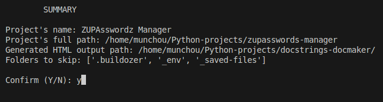
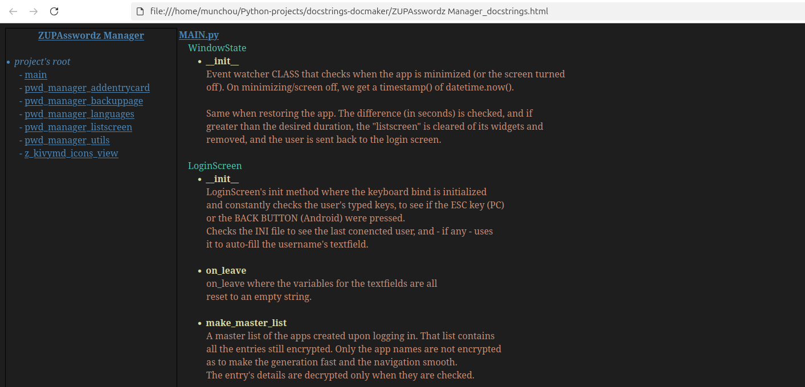

# Docstrings HTML Documentation Maker
<i>last updated: May 9, 2025</i>

## OPEN SOURCE, but:
License permissions: Distribution (for free, NO commcercial use, NO patent), Modification, Private use 
Conditions: Disclose source, License and copyright notice

## About that awesome program
You believe pydoc is a lazy ass who doesn't want to do its simple task and throws some useless errors? Sphinx is too much for just what you want to do, because you just want to get the docstrings of your project without spending too long in getting the output?

There you have it: my docstrings documentation generator. 
It generates an organized HTML with nav menu of all the docstrings of a project 
A simple terminal interface (no CLI, come on, I'm not a monster), the possibility to add folders to be skipped (useful if you've got virtual environmenet folders, backup folders, etc. that you don't want to get the docstrings from).

All you need to do is:
- add your project name
- add the path to that project
- add the output path where you want your HTML to be generated (blank = generated in the folder where the script is summoned from)
- add any folders you want to be skipped

You confirm, wait a little, and you get a fancy generated HTML. No CSS, no other files, just a simple HTML file, easy to copy, share, erase by accident. Life can be beautiful, right?

<b>IMPORTANT: your docstrings must be written in triple double-quotes: """, not single-quotes ''' (who does that anyway?).</b>

## A screenshot, because generosity

## Problem? Want to contribute?
Just contact me! 
